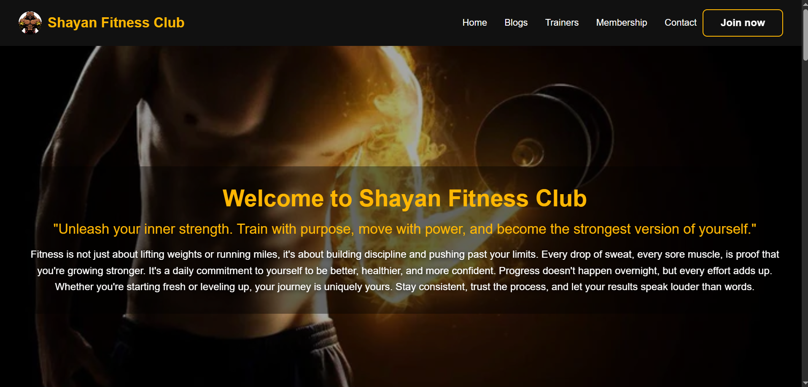
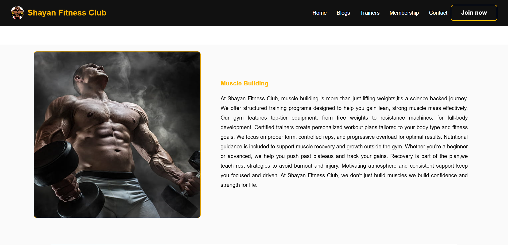
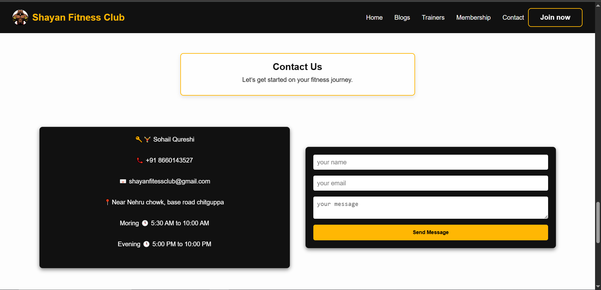
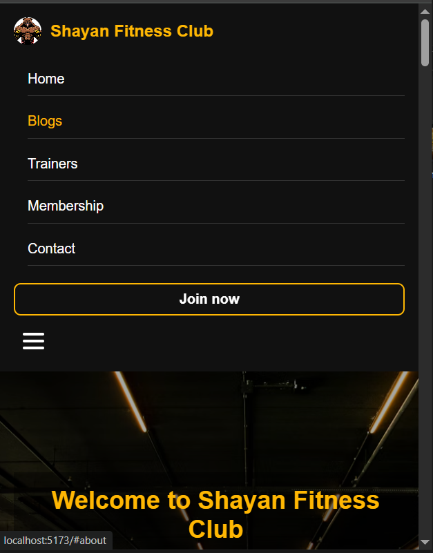
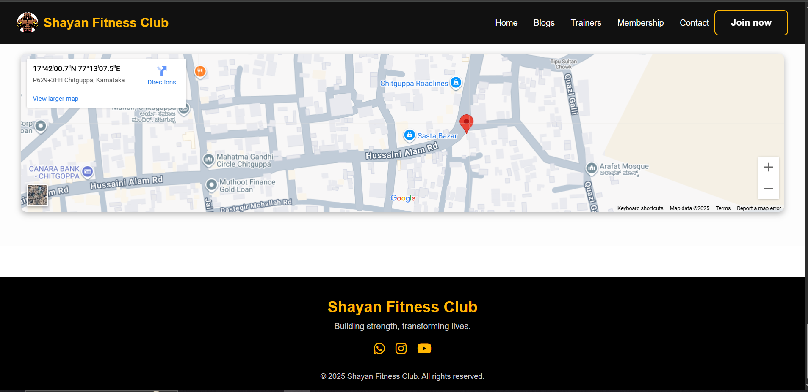

# FITNESS CLUB

A modern, responsive gym website with membership plans, trainer service, contact, and fitness blogs.

## Live Demo

[View Website](https://shayanfitnessclub.netlify.app)

## Features

- Membership plans with pricing
- Fitness blog section
- Responsive design
- Built with React and Vite
- Responsive for mobile and tablet devices

##  Tech Stack

- **Frontend:** React, Vite
- **Styling:** CSS / TailwindCSS
- **Deployment:** GitHub Pages / Vercel / Netlify


## Installation

```bash
git clone https://github.com/shujauddin06/fitness-club.git
cd fitness-club
npm install
npm run dev
```

## Summary

Fitness Club is a responsive gym website that helps users explore membership plans and read fitness blogs.  
Built with React and Vite, it aims to provide a smooth and engaging user experience for fitness enthusiasts.

## Screenshots

### Homepage


### Blog Section


### Contact Section


### Phone Screen


### Location Map

